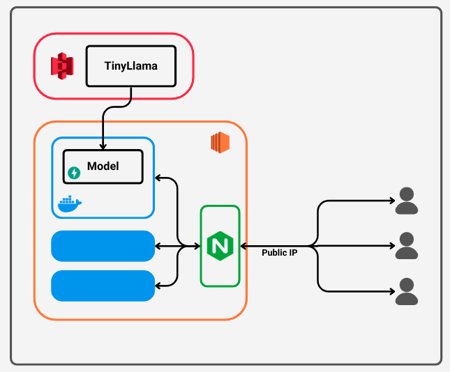

# TinyLlama Chatbot Fine-Tuning

<p align="center">
  <strong>A production-ready conversational AI chatbot powered by TinyLlama-1.1B with fine-tuning capabilities</strong>
</p>

<p align="center">
  <a href="#quick-start">Quick Start</a> •
  <a href="#features">Features</a> •
  <a href="#api-reference">API Docs</a> •
  <a href="#deployment">Deployment</a> •
  <a href="https://www.canva.com/design/DAG1xSh07_c/M_hb1V3nN00kk1GphQRBNg/edit?utm_content=DAG1xSh07_c&utm_campaign=designshare&utm_medium=link2&utm_source=sharebutton">Full Documentation</a>
</p>

---

## Overview

This project provides a complete solution for deploying and fine-tuning TinyLlama-1.1B language model as a conversational AI chatbot. It includes a FastAPI backend, Streamlit web interface, and containerized deployment with Docker Compose.

### Key Highlights

- **Lightweight & Fast**: Optimized with 8-bit quantization for efficient inference
- **Production Ready**: Multi-container architecture with Nginx reverse proxy
- **Fine-tuning Support**: Built-in PEFT adapters for custom training
- **Cloud Storage**: AWS S3 integration for model versioning and storage

## Screenshots

<details>
<summary><b>View Application Screenshots</b></summary>

<br>

**Deployment Architecture**


**Streamlit Web Interface**


**Conversation Example**


</details>

## Features

| Feature | Description |
|---------|-------------|
| **TinyLlama-1.1B Model** | Lightweight language model optimized for conversational AI |
| **Conversation Memory** | Intelligent context management with configurable history length |
| **FastAPI Backend** | High-performance REST API with OpenAPI documentation |
| **Streamlit Frontend** | Interactive web interface with real-time chat |
| **Docker Support** | Multi-container orchestration with GPU support |
| **Fine-tuning Ready** | PEFT adapters for parameter-efficient training |
| **GPU Acceleration** | 8-bit quantization for optimized inference |
| **AWS S3 Integration** | Cloud storage for model versioning and deployment |

## Table of Contents

- [Overview](#overview)
- [Screenshots](#screenshots)
- [Features](#features)
- [Project Structure](#project-structure)
- [Quick Start](#quick-start)
  - [Prerequisites](#prerequisites)
  - [Installation](#installation)
  - [Manual Setup](#manual-setup-without-docker)
- [API Reference](#api-reference)
- [Configuration](#configuration)
- [Model Fine-Tuning](#model-fine-tuning)
- [Deployment](#deployment)
- [Troubleshooting](#troubleshooting)
- [Technology Stack](#technology-stack)
- [Contributing](#contributing)
- [License](#license)

## Project Structure

```
Tiny-LLAMA-Chatbot-Fine-Tuning/
│
├── api/                        # FastAPI Backend Service
│   ├── app.py                  # Main API server with conversation endpoints
│   ├── Dockerfile              # API container configuration
│   └── requirements.txt        # Backend dependencies
│
├── app/                        # Streamlit Frontend Service
│   ├── app.py                  # Web interface application
│   ├── Dockerfile              # Frontend container configuration
│   └── requirements.txt        # Frontend dependencies
│
├── components/                 # Training & Deployment Utilities
│   ├── trainer.py              # Model fine-tuning script
│   └── pusher.py               # Model deployment to S3
│
├── utils/                      # Shared Utilities
│   ├── data_model.py           # Pydantic data models
│   └── io.py                   # AWS S3 I/O operations
│
├── saved_models/               # Fine-tuned Model Storage
│   ├── TinyLlama-1.1B-Chat-v1.0/
│   ├── TinyLlama-1.1B-Chat-v1.1/
│   └── TinyLlama-1.1B-Chat-v1.2/  # Current version
│
├── nginx/                      # Reverse Proxy Configuration
│   ├── Dockerfile
│   └── nginx.conf
│
├── assets/                     # Documentation Assets
│   └── images/
│
├── docker-compose.yml          # Multi-container orchestration
├── docker-compose.prod.yml     # Production configuration
└── requirements.txt            # Root dependencies
```

## Quick Start

### Prerequisites

| Requirement | Description |
|-------------|-------------|
| **Docker & Docker Compose** | Container orchestration platform |
| **NVIDIA GPU** | Recommended for faster inference (optional) |
| **AWS Account** | For S3 model storage access |

### Installation

**Step 1: Clone the Repository**
```bash
git clone https://github.com/mausneg/Tiny-LLAMA-Chatbot-Fine-Tuning.git
cd Tiny-LLAMA-Chatbot-Fine-Tuning
```

**Step 2: Configure AWS Credentials**

Create a `.env` file in the project root:
```bash
AWS_ACCESS_KEY_ID=your_aws_access_key_id
AWS_SECRET_ACCESS_KEY=your_aws_secret_access_key
```

**Step 3: Launch Services**
```bash
docker compose up --build
```

**Step 4: Access the Application**

| Service | URL | Description |
|---------|-----|-------------|
| **Streamlit UI** | http://localhost:8501 | Interactive chat interface |
| **API Docs** | http://localhost:8082/docs | OpenAPI documentation |
| **API Endpoint** | http://localhost:8082/api/v1/ | REST API base URL |

### Manual Setup (Without Docker)

<details>
<summary><b>Click to expand manual setup instructions</b></summary>

**1. Install Dependencies**
```bash
pip install -r requirements.txt
```

**2. Set AWS Credentials**
```bash
export AWS_ACCESS_KEY_ID="your_access_key_id"
export AWS_SECRET_ACCESS_KEY="your_secret_access_key"
```

**3. Start API Server**
```bash
cd api
uvicorn app:app --host 0.0.0.0 --port 5003
```

**4. Start Streamlit App** (new terminal)
```bash
cd app
streamlit run app.py --server.port 8501
```

</details>

## API Reference

### Endpoints

#### POST `/api/v1/conversation`
Send conversation history to the chatbot and receive a response.

**Request Body:**
```json
{
  "timestamp": "2024-10-17T10:30:00",
  "content": [
    "<|user|>\nHello, how are you?",
    "<|assistant|>\nI'm fine, thank you! How can I assist you today?",
    "<|user|>\nWrite a Python function to calculate factorial"
  ]
}
```

**Parameters:**
- `timestamp` (string): Timestamp of the message
- `content` (array of strings): List of conversation history with role tags (`<|user|>`, `<|assistant|>`)

**Response:**
```json
{
  "response": "Assistant's full response including conversation history"
}
```

**Example:**
```bash
curl -X POST http://localhost:8082/api/v1/conversation \
  -H "Content-Type: application/json" \
  -d '{
    "timestamp": "2024-10-17T10:30:00",
    "content": [
      "<|user|>\nWrite a Python function to calculate factorial"
    ]
  }'
```

#### DELETE `/api/v1/conversation`
Clear the conversation history.

**Response:**
```json
{
  "message": "Conversation cleared",
  "status": "success"
}
```

**Example:**
```bash
curl -X DELETE http://localhost:8082/api/v1/conversation
```

### Message Format

The API expects conversation history in a specific format:
```
<|user|>
Your message here
<|assistant|>
Assistant's response here
```

Each message in the `content` array should include the role tag followed by the message text.

## Configuration

### Model Configuration

The model settings are defined in `api/app.py`:

| Parameter | Value | Description |
|-----------|-------|-------------|
| `MODEL_NAME` | `TinyLlama-1.1B-Chat-v1.2` | Current model version |
| `MAX_LENGTH` | `2048` | Maximum context window size |
| `load_in_8bit` | `True` | 8-bit quantization for efficiency |

### AWS S3 Configuration

Configure S3 storage settings in `utils/io.py`:

| Parameter | Value |
|-----------|-------|
| `bucket_name` | `mausneg-mlops` |
| `s3_prefix` | `saved_models` |

### Environment Variables

Create a `.env` file:

```bash
AWS_ACCESS_KEY_ID=your_aws_access_key_id
AWS_SECRET_ACCESS_KEY=your_aws_secret_access_key
```

### Docker Services

| Service | Port | Description |
|---------|------|-------------|
| **API** | 5003 | FastAPI backend service |
| **Nginx** | 8082 | Reverse proxy and load balancer |
| **Streamlit** | 8501 | Web interface (if configured) |

**GPU Support**: Automatically enabled via Docker Compose device allocation.

## Model Fine-Tuning

### Training Process

The project includes utilities for fine-tuning the TinyLlama model:

1. **Prepare Training Data**: Format your data in conversation format
2. **Configure Training**: Modify parameters in `components/trainer.py`
3. **Run Training**: Execute the training notebook or script
4. **Upload Model**: Use `components/pusher.py` to upload to S3

Training notebook available at:
```
saved_models/Tiny_LLAMA_1_1B_Instruction_Tuning.ipynb
```

### Available Fine-tuned Models

The project includes three fine-tuned model versions:
- `TinyLlama-1.1B-Chat-v1.0`
- `TinyLlama-1.1B-Chat-v1.1`
- `TinyLlama-1.1B-Chat-v1.2` (current)

Each model contains:
- `adapter_config.json`: PEFT adapter configuration
- `adapter_model.safetensors`: Fine-tuned model weights

## Deployment

### Production Deployment

Use the production Docker Compose configuration:

```bash
docker compose -f docker-compose.prod.yml up -d
```

### Deployment Checklist

1. Set production environment variables in `.env`
2. Configure SSL certificates for Nginx (if needed)
3. Update CORS settings in `api/app.py`
4. Set up monitoring and logging
5. Configure backup for model files

### Container Management

```bash
# Start services
docker compose up -d

# View logs
docker compose logs -f

# Stop services
docker compose down

# Rebuild specific service
docker compose build api
docker compose up -d api
```

## Troubleshooting

<details>
<summary><b>Common Issues & Solutions</b></summary>

### AWS Credentials Error

**Error:**
```
botocore.exceptions.ClientError: InvalidAccessKeyId
```

**Solutions:**
- Verify credentials in `.env` file are correct
- Check credentials haven't expired in AWS IAM Console
- Ensure IAM user has S3 read permissions
- Confirm credentials are loaded in container environment

### Model Download Failure

**Solutions:**
- Verify AWS S3 bucket access permissions
- Check model path exists: `saved_models/TinyLlama-1.1B-Chat-v1.2`
- Test network connectivity to AWS S3
- Review container logs: `docker compose logs api`

### GPU Memory Issues

**Solutions:**
- Model uses 8-bit quantization by default (already optimized)
- Reduce `MAX_LENGTH` parameter in `api/app.py`
- Monitor GPU memory: `nvidia-smi`
- Restart containers: `docker compose restart`

### Slow Response Times

**Solutions:**
- Verify GPU is enabled: `docker compose ps` and check device allocation
- Check container resource limits: `docker stats`
- Reduce `max_new_tokens` in generation pipeline
- Ensure no other GPU-intensive processes are running

### Connection Refused

**Solutions:**
- Verify all containers are running: `docker compose ps`
- Check port availability: `netstat -tulpn | grep 8082`
- Review Nginx logs: `docker compose logs nginx`
- Restart services: `docker compose down && docker compose up -d`

</details>

### Monitoring Commands

```bash
# Check GPU utilization
nvidia-smi

# Monitor API logs
docker compose logs -f api

# Monitor Nginx logs
docker compose logs -f nginx

# Check resource usage
docker stats

# Test API health
curl http://localhost:8082/docs
```

## Technology Stack

| Category | Technologies |
|----------|--------------|
| **Machine Learning** | PyTorch, Transformers, PEFT, BitsAndBytes |
| **Backend** | FastAPI, Uvicorn |
| **Frontend** | Streamlit |
| **Infrastructure** | Docker, Docker Compose, Nginx |
| **Cloud Storage** | AWS S3, Boto3 |
| **Model** | TinyLlama-1.1B-Chat |

## Contributing

We welcome contributions! Here's how you can help:

1. **Fork** the repository
2. **Create** a feature branch: `git checkout -b feature/your-feature`
3. **Commit** your changes: `git commit -m 'Add new feature'`
4. **Push** to the branch: `git push origin feature/your-feature`
5. **Open** a Pull Request

Please ensure your code follows the project's coding standards and includes appropriate tests.

## License

This project is licensed under the **MIT License**. See the [LICENSE](LICENSE) file for details.

## Acknowledgments

This project builds upon excellent open-source work:

- [TinyLlama](https://github.com/jzhang38/TinyLlama) - Base language model
- [Hugging Face](https://huggingface.co) - Transformers library and model hub
- [PEFT](https://github.com/huggingface/peft) - Parameter-efficient fine-tuning library
- [FastAPI](https://fastapi.tiangolo.com) - Modern web framework
- [Streamlit](https://streamlit.io) - Interactive web application framework

## Support

**Need help?**

- Open an issue on [GitHub Issues](https://github.com/mausneg/Tiny-LLAMA-Chatbot-Fine-Tuning/issues)
- Check the [API Documentation](http://localhost:8082/docs)
- Review the [Full Documentation](https://www.canva.com/design/DAG1xSh07_c/M_hb1V3nN00kk1GphQRBNg/edit)
- Read the [Troubleshooting](#troubleshooting) section

---

<p align="center">
  <sub>Built with ❤️ for the AI community</sub>
</p>

<p align="center">
  <sub><strong>Note:</strong> This project is intended for educational and research purposes. Please ensure responsible AI usage and implement appropriate safety measures for production deployments.</sub>
</p>