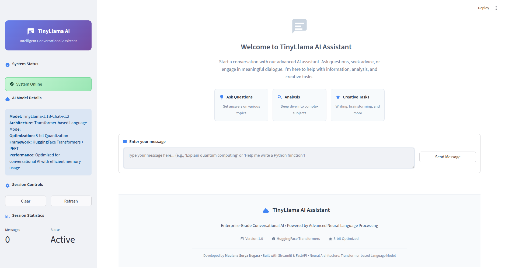
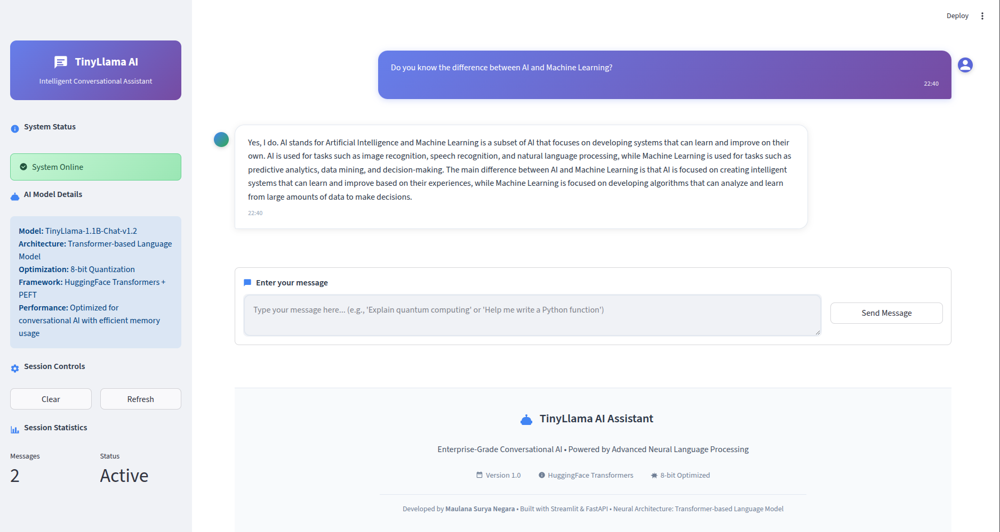

# TinyLlama Chatbot Fine-Tuning

A production-ready conversational AI chatbot powered by TinyLlama-1.1B model with fine-tuning capabilities. This project includes a FastAPI backend, Streamlit web interface, and Docker deployment configuration.

## Screenshots

### Streamlit Web Interface


### Usage Example


## Features

- **TinyLlama-1.1B Model**: Lightweight language model optimized for conversational AI
- **Conversation Memory**: Maintains chat history with intelligent context management
- **FastAPI Backend**: High-performance REST API with automatic documentation
- **Streamlit Frontend**: Interactive web interface for chat interactions
- **Docker Support**: Multi-container deployment with Nginx reverse proxy
- **Fine-tuning Ready**: Built with PEFT (Parameter Efficient Fine-Tuning) support
- **GPU Acceleration**: 8-bit quantization for optimized performance
- **AWS S3 Integration**: Model storage and retrieval from cloud storage

## Project Structure

```
├── api/                    # FastAPI backend
│   ├── app.py             # Main API server
│   ├── Dockerfile         # API container configuration
│   └── requirements.txt   # API dependencies
├── app/                   # Streamlit frontend
│   ├── app.py             # Web interface
│   ├── Dockerfile         # Frontend container configuration
│   └── requirements.txt   # Frontend dependencies
├── components/            # Training and deployment utilities
│   ├── trainer.py         # Model training script
│   └── pusher.py          # Model deployment script
├── utils/                 # Shared utilities
│   ├── data_model.py      # Pydantic data models
│   └── io.py              # AWS S3 I/O operations
├── saved_models/          # Fine-tuned model storage
├── nginx/                 # Reverse proxy configuration
│   ├── Dockerfile
│   └── nginx.conf
└── docker-compose.yml     # Multi-container orchestration
```

## Quick Start

### Prerequisites

- Docker and Docker Compose
- NVIDIA GPU with CUDA support (recommended)
- AWS credentials for S3 model storage

### Installation

1. Clone the repository:
   ```bash
   git clone https://github.com/mausneg/Tiny-LLAMA-Chatbot-Fine-Tuning.git
   cd Tiny-LLAMA-Chatbot-Fine-Tuning
   ```

2. Configure AWS credentials:
   
   Create a `.env` file in the project root:
   ```bash
   AWS_ACCESS_KEY_ID=your_aws_access_key_id
   AWS_SECRET_ACCESS_KEY=your_aws_secret_access_key
   ```

3. Start the application:
   ```bash
   docker compose up --build
   ```

4. Access the services:
   - **Streamlit UI**: http://localhost:8501
   - **API Documentation**: http://localhost:8082/docs
   - **API Endpoint**: http://localhost:8082/api/v1/

### Manual Setup (Without Docker)

1. Install dependencies:
   ```bash
   pip install -r requirements.txt
   ```

2. Set AWS credentials:
   ```bash
   export AWS_ACCESS_KEY_ID="your_access_key_id"
   export AWS_SECRET_ACCESS_KEY="your_secret_access_key"
   ```

3. Run the API server:
   ```bash
   cd api
   uvicorn app:app --host 0.0.0.0 --port 5003
   ```

4. Run the Streamlit app (in another terminal):
   ```bash
   cd app
   streamlit run app.py --server.port 8501
   ```

## API Reference

### Endpoints

#### POST `/api/v1/conversation`
Send conversation history to the chatbot and receive a response.

**Request Body:**
```json
{
  "timestamp": "2024-10-17T10:30:00",
  "content": [
    "<|user|>\nHello, how are you?",
    "<|assistant|>\nI'm fine, thank you! How can I assist you today?",
    "<|user|>\nWrite a Python function to calculate factorial"
  ]
}
```

**Parameters:**
- `timestamp` (string): Timestamp of the message
- `content` (array of strings): List of conversation history with role tags (`<|user|>`, `<|assistant|>`)

**Response:**
```json
{
  "response": "Assistant's full response including conversation history"
}
```

**Example:**
```bash
curl -X POST http://localhost:8082/api/v1/conversation \
  -H "Content-Type: application/json" \
  -d '{
    "timestamp": "2024-10-17T10:30:00",
    "content": [
      "<|user|>\nWrite a Python function to calculate factorial"
    ]
  }'
```

#### DELETE `/api/v1/conversation`
Clear the conversation history.

**Response:**
```json
{
  "message": "Conversation cleared",
  "status": "success"
}
```

**Example:**
```bash
curl -X DELETE http://localhost:8082/api/v1/conversation
```

### Message Format

The API expects conversation history in a specific format:
```
<|user|>
Your message here
<|assistant|>
Assistant's response here
```

Each message in the `content` array should include the role tag followed by the message text.

## Configuration

### Model Configuration

The model settings are defined in `api/app.py`:

```python
MODEL_NAME = 'TinyLlama-1.1B-Chat-v1.2'
MODEL_PATH = f'saved_models/{MODEL_NAME}'
MAX_LENGTH = 2048  # Maximum context length
```

### AWS S3 Configuration

Model files are stored in AWS S3. Configure in `utils/io.py`:

```python
bucket_name = "mausneg-mlops"
s3_prefix = "saved_models"
```

### Environment Variables

Create a `.env` file with the following variables:

```bash
AWS_ACCESS_KEY_ID=your_aws_access_key_id
AWS_SECRET_ACCESS_KEY=your_aws_secret_access_key
```

### Docker Compose Configuration

The `docker-compose.yml` includes:
- **API Service**: FastAPI backend on port 5003
- **Nginx Service**: Reverse proxy on port 8082
- **GPU Support**: Automatic GPU device allocation

## Model Fine-Tuning

### Training Process

The project includes utilities for fine-tuning the TinyLlama model:

1. **Prepare Training Data**: Format your data in conversation format
2. **Configure Training**: Modify parameters in `components/trainer.py`
3. **Run Training**: Execute the training notebook or script
4. **Upload Model**: Use `components/pusher.py` to upload to S3

Training notebook available at:
```
saved_models/Tiny_LLAMA_1_1B_Instruction_Tuning.ipynb
```

### Available Fine-tuned Models

The project includes three fine-tuned model versions:
- `TinyLlama-1.1B-Chat-v1.0`
- `TinyLlama-1.1B-Chat-v1.1`
- `TinyLlama-1.1B-Chat-v1.2` (current)

Each model contains:
- `adapter_config.json`: PEFT adapter configuration
- `adapter_model.safetensors`: Fine-tuned model weights

## Deployment

### Production Deployment

Use the production Docker Compose configuration:

```bash
docker compose -f docker-compose.prod.yml up -d
```

### Deployment Checklist

1. Set production environment variables in `.env`
2. Configure SSL certificates for Nginx (if needed)
3. Update CORS settings in `api/app.py`
4. Set up monitoring and logging
5. Configure backup for model files

### Container Management

```bash
# Start services
docker compose up -d

# View logs
docker compose logs -f

# Stop services
docker compose down

# Rebuild specific service
docker compose build api
docker compose up -d api
```

## Troubleshooting

### Common Issues

#### 1. AWS Credentials Error
```
botocore.exceptions.ClientError: InvalidAccessKeyId
```
**Solution**:
- Verify AWS credentials in `.env` file
- Check credentials expiration in AWS IAM Console
- Ensure credentials have S3 read permissions

#### 2. Model Download Failure
**Solution**:
- Check AWS S3 bucket access
- Verify model path: `saved_models/TinyLlama-1.1B-Chat-v1.2`
- Check network connectivity to AWS

#### 3. GPU Memory Issues
**Solution**:
- Model uses 8-bit quantization by default
- Reduce `MAX_LENGTH` in `api/app.py`
- Monitor GPU usage: `nvidia-smi`

#### 4. Slow Response Times
**Solution**:
- Ensure GPU is enabled in Docker Compose
- Check container resource allocation
- Reduce `max_new_tokens` parameter

#### 5. Connection Refused
**Solution**:
- Verify all containers are running: `docker compose ps`
- Check port availability: `netstat -tulpn | grep 8082`
- Review Nginx configuration

### Monitoring

```bash
# Check GPU usage
nvidia-smi

# Monitor container logs
docker compose logs -f api
docker compose logs -f nginx

# Check container resource usage
docker stats

# Test API endpoint
curl http://localhost:8082/docs
```

## Technology Stack

- **Machine Learning**: PyTorch, Transformers, PEFT, BitsAndBytes
- **Backend**: FastAPI, Uvicorn
- **Frontend**: Streamlit
- **Infrastructure**: Docker, Nginx
- **Storage**: AWS S3, Boto3
- **Model**: TinyLlama-1.1B-Chat

## Contributing

Contributions are welcome! Please follow these steps:

1. Fork the repository
2. Create a feature branch: `git checkout -b feature/your-feature`
3. Commit your changes: `git commit -m 'Add new feature'`
4. Push to the branch: `git push origin feature/your-feature`
5. Open a Pull Request

## License

This project is licensed under the MIT License. See the LICENSE file for details.

## Acknowledgments

- [TinyLlama](https://github.com/jzhang38/TinyLlama) - Base language model
- [Hugging Face](https://huggingface.co) - Transformers library and model hosting
- [PEFT](https://github.com/huggingface/peft) - Parameter-efficient fine-tuning
- [FastAPI](https://fastapi.tiangolo.com) - Modern web framework
- [Streamlit](https://streamlit.io) - Interactive web applications

## Support

For issues and questions:
- Open an issue on [GitHub Issues](https://github.com/mausneg/Tiny-LLAMA-Chatbot-Fine-Tuning/issues)
- Check the API documentation at http://localhost:8082/docs
- Review the troubleshooting section above

---

**Note**: This project is intended for educational and research purposes. Ensure responsible AI usage and implement appropriate safety measures for production deployments.